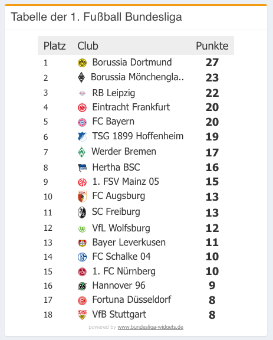

# Deutsche Bundesliga

- Jersey Rest Client
- javax.json
- jdbc

## Ausgangssituation

Im Web können u.a. die Ergebnisse der deutschen Bundesliga im Portal "OpenLigaDB" abgerufen werden.


## Aufgabenstellung

### Level 1

Als Programmierer erhalten Sie den Auftrag einen kleinen JavaSE-Client zu erstellen, der die Spieltage per REST abruft, die Daten strukturiert in Java-Objekten speichert und diese in einem Repository speichert.

Dazu erstellen Sie zunächst ein kleines Menü:

```json
***************************************************

            Statistik deutsche Bundesliga
                  am 11.Spieltag

***************************************************


1 - update repository from rest
2 - show matches on screen
3 - persist repository in db
4 - current Bundesliga table
5 - change matchday
0 - exit


Wählen Sie aus (Ziffer + <Enter>): 
```

Wird die Option 1 gewählt, so sieht werden die Daten synchron abgerufen, im Repository in einem JsonArray gespeichert und es wird folgendes ausgegeben:

```json
***************************************************

            Statistik deutsche Bundesliga
                  am 11.Spieltag

***************************************************


1 - update repository from rest
2 - show matches on screen
3 - persist repository in db
4 - current Bundesliga table
5 - change matchday
0 - exit


Wählen Sie aus (Ziffer + <Enter>): 1
[
  {
    "MatchID":51215,
    "MatchDateTime":"2018-11-09T20:30:00",
    "TimeZoneID":"W. Europe Standard Time",
    "LeagueId":4276,
    "LeagueName":"1. Fußball-Bundesliga 2018/2019",
    "MatchDateTimeUTC":"2018-11-09T19:30:00Z",
    "Group":{
      "GroupName":"11. Spieltag",
      "GroupOrderID":11,
      "GroupID":31785
    },
    "Team1":{
      "TeamId":55,
      "TeamName":"Hannover 96",
      "ShortName":"Hannover",
      "TeamIconUrl":"https://upload.wikimedia.org/wikipedia/commons/thumb/c/cd/Hannover_96_Logo.svg/1162px-Hannover_96_Logo.svg.png",
      "TeamGroupName":null
    },
    "Team2":{
      "TeamId":131,
      "TeamName":"VfL Wolfsburg",
      "ShortName":"VfL Wolfsburg",
      "TeamIconUrl":"https://upload.wikimedia.org/wikipedia/commons/thumb/f/f3/Logo-VfL-Wolfsburg.svg/1024px-Logo-VfL-Wolfsburg.svg.png",
      "TeamGroupName":null
    },
    "LastUpdateDateTime":"2018-11-09T22:42:15.097",
    "MatchIsFinished":true,
    "MatchResults":[
      {
        "ResultID":84309,
        "ResultName":"Endergebnis",
        "PointsTeam1":2,
        "PointsTeam2":1,
        "ResultOrderID":2,
        "ResultTypeID":2,
        "ResultDescription":"Ergebnis nach Ende der offiziellen Spielzeit"
      },
      {
        "ResultID":84310,
        "ResultName":"Halbzeit",
        "PointsTeam1":1,
        "PointsTeam2":0,
        "ResultOrderID":1,
        "ResultTypeID":1,
        "ResultDescription":"Zwischenstand zur Halbzeit"
      }
    ],
    "Goals":[
      {
        "GoalID":73491,
        "ScoreTeam1":1,
        "ScoreTeam2":0,
        "MatchMinute":31,
        "GoalGetterID":16980,
        "GoalGetterName":"Maina, L.",
        "IsPenalty":false,
        "IsOwnGoal":false,
        "IsOvertime":false,
        "Comment":null
      },
      {
        "GoalID":73492,
        "ScoreTeam1":2,
        "ScoreTeam2":0,
        "MatchMinute":62,
        "GoalGetterID":15011,
        "GoalGetterName":"Bebou",
        "IsPenalty":true,
        "IsOwnGoal":false,
        "IsOvertime":false,
        "Comment":null
      },
      {
        "GoalID":73493,
        "ScoreTeam1":2,
        "ScoreTeam2":1,
        "MatchMinute":82,
        "GoalGetterID":16906,
        "GoalGetterName":"Weghorst",
        "IsPenalty":true,
        "IsOwnGoal":false,
        "IsOvertime":false,
        "Comment":null
      }
    ],
    "Location":null,
    "NumberOfViewers":null
  },
  {
    "MatchID":51216,
    "MatchDateTime":"2018-11-10T15:30:00",
    "TimeZoneID":"W. Europe Standard Time",
    "LeagueId":4276,
    "LeagueName":"1. Fußball-Bundesliga 2018/2019",
    "MatchDateTimeUTC":"2018-11-10T14:30:00Z",
    "Group":{
      "GroupName":"11. Spieltag",
      "GroupOrderID":11,
      "GroupID":31785
    },
    "Team1":{
      "TeamId":112,
      "TeamName":"SC Freiburg",
      "ShortName":"Freiburg",
      "TeamIconUrl":"https://upload.wikimedia.org/wikipedia/de/thumb/f/f1/SC-Freiburg_Logo-neu.svg/739px-SC-Freiburg_Logo-neu.svg.png",
      "TeamGroupName":null
    },
    "Team2":{
      "TeamId":81,
      "TeamName":"1. FSV Mainz 05",
      "ShortName":"Mainz 05",
      "TeamIconUrl":"https://upload.wikimedia.org/wikipedia/commons/thumb/9/9e/Logo_Mainz_05.svg/1099px-Logo_Mainz_05.svg.png",
      "TeamGroupName":null
    },
    "LastUpdateDateTime":"2018-11-10T17:22:35.213",
    "MatchIsFinished":true,
    "MatchResults":[
      {
...
]
***************************************************

            Statistik deutsche Bundesliga
                  am 11.Spieltag

***************************************************


1 - update repository from rest
2 - show matches on screen
3 - persist repository in db
4 - current Bundesliga table
5 - change matchday
0 - exit


Wählen Sie aus (Ziffer + <Enter>): 
```

Mit der __Option 2__ wird der Inhalt des jsonArrays in ein Set<Match> übertragen. Sämtliche Werte - inklusive id - werden aus dem Json-Dokument ausgelesen. Vergessen Sie das Datum/Zeit-Feld (Timestamp) nicht.

```json
***************************************************

            Statistik deutsche Bundesliga
                  am 11.Spieltag

***************************************************


1 - update repository from rest
2 - show matches on screen
3 - persist repository in db
4 - current Bundesliga table
5 - change matchday
0 - exit


Wählen Sie aus (Ziffer + <Enter>): 2

51217: Spieltag 11, Düsseldorf 4 : Hertha 1
51218: Spieltag 11, Nürnberg 0 : Stuttgart 2
51210: Spieltag 11, Hoffenheim 2 : Augsburg 1
51211: Spieltag 11, BVB  09 3 : FCB 2
51212: Spieltag 11, RBL Leipzig 3 : Leverkusen 0
51213: Spieltag 11, Frankfurt 3 : Schalke 0
51214: Spieltag 11, Bremen 1 : M'gladbach 3
51215: Spieltag 11, Hannover 2 : VfL Wolfsburg 1
51216: Spieltag 11, Freiburg 1 : Mainz 05 3
```

So sehen die Java-Objekte aus:


Mit der __Option 5__ wird ein neuer Spieltag ausgewählt. Beachten Sie, dass sich der Header des Menüs ändert.

```json
***************************************************

            Statistik deutsche Bundesliga
                  am 11.Spieltag

***************************************************


1 - update repository from rest
2 - show matches on screen
3 - persist repository in db
4 - current Bundesliga table
5 - change matchday
0 - exit


Wählen Sie aus (Ziffer + <Enter>): 5
Geben Sie einen neuen Spieltag ein: 10


***************************************************

            Statistik deutsche Bundesliga
                  am 10.Spieltag

***************************************************


1 - update repository from rest
2 - show matches on screen
3 - persist repository in db
4 - current Bundesliga table
5 - change matchday
0 - exit


Wählen Sie aus (Ziffer + <Enter>): 
```

Werden nun die Daten neu importiert (__Option 1__) und mit __Option 2__ angezeigt, so gibt es zwei Spieltage in unserem Repository:

```json
***************************************************

            Statistik deutsche Bundesliga
                  am 10.Spieltag

***************************************************


1 - update repository from rest
2 - show matches on screen
3 - persist repository in db
4 - current Bundesliga table
5 - change matchday
0 - exit


Wählen Sie aus (Ziffer + <Enter>): 2
51201: Spieltag 10, FCB 1 : Freiburg 1
51202: Spieltag 10, Schalke 3 : Hannover 1
51203: Spieltag 10, Leverkusen 1 : Hoffenheim 4
51204: Spieltag 10, Stuttgart 0 : Frankfurt 3
51205: Spieltag 10, M'gladbach 3 : Düsseldorf 0
51206: Spieltag 10, Hertha 0 : RBL Leipzig 3
51207: Spieltag 10, Augsburg 2 : Nürnberg 2
51208: Spieltag 10, Mainz 05 2 : Bremen 1
51209: Spieltag 10, VfL Wolfsburg 0 : BVB  09 1
51210: Spieltag 11, Hoffenheim 2 : Augsburg 1
51211: Spieltag 11, BVB  09 3 : FCB 2
51212: Spieltag 11, RBL Leipzig 3 : Leverkusen 0
51213: Spieltag 11, Frankfurt 3 : Schalke 0
51214: Spieltag 11, Bremen 1 : M'gladbach 3
51215: Spieltag 11, Hannover 2 : VfL Wolfsburg 1
51216: Spieltag 11, Freiburg 1 : Mainz 05 3
51217: Spieltag 11, Düsseldorf 4 : Hertha 1
51218: Spieltag 11, Nürnberg 0 : Stuttgart 2
```

### Level 2

- Mit der __Option 3__ werden die Daten aus dem Repository (nur das Set Matches) in die Datenbank gespeichert (2 Tabellen: MATCH und TEAM)
- Erstellen Sie für den DB-Zugriff eine MatchDao und eine TeamDao (Data Access Object).
- Die Teams werden dabei automatisch entsprechend den Spielen mit in der Datenbank gespeichert
- Falls __Option 3__ gedrückt wird, ohne das vorher __Option 1__ (zum Download der Spiele) und __Option 2__ (zum Erstellen des Java-Objekte-Sets) gedrückt werden, so wird eine Fehlermeldung ausgegeben:

	```
	Datenbank ist leer, downloaden Sie zuerst die Spiele
	```
- Bei jedem Start des Programms werden die Tabellen gelöscht und neu angelegt.

#### ERD:


### Level 3

Mit der __Option 4__ wird die aktuelle Bundesligatabelle angezeigt.
Dazu ist es wahrscheinlich sinnvoll, das Einlesen aller Spieltage zu automatisieren.



## Klassendiagramm


## Bewertung

- Bei der Bewertung werden die Optionen 1, 2 und 3 in dieser Reihenfolge gedrückt. Nun wird kontrolliert, ob die Bildschirmausgabe korrekt ist und ob die Datenbankinhalte korrekt sind
- Anschließend wird das Programm neu gestartet und noch einmal geprüft
- Nun wird der Matchday geändert (Option 5)
- Die Optionen 1, 2 und 3 werden wieder ausgeführt und kontrolliert.
- Es wird kontrolliert, ob Set<Match> korrekt ist


```
 _   _ _      _   _____      __      _       _ 
| | | (_)    | | |  ___|    / _|    | |     | |
| | | |_  ___| | | |__ _ __| |_ ___ | | __ _| |
| | | | |/ _ \ | |  __| '__|  _/ _ \| |/ _` | |
\ \_/ / |  __/ | | |__| |  | || (_) | | (_| |_|
 \___/|_|\___|_| \____/_|  |_| \___/|_|\__, (_)
                                        __/ |  
                                       |___/   
```                                      
                                      