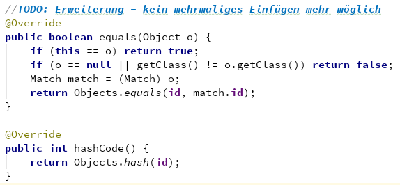
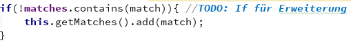
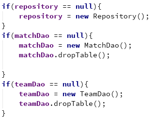
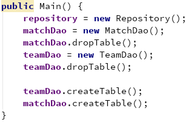
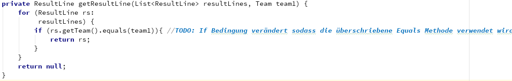
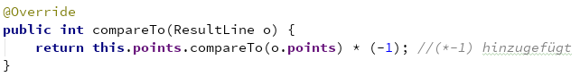
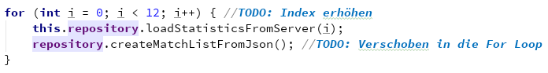
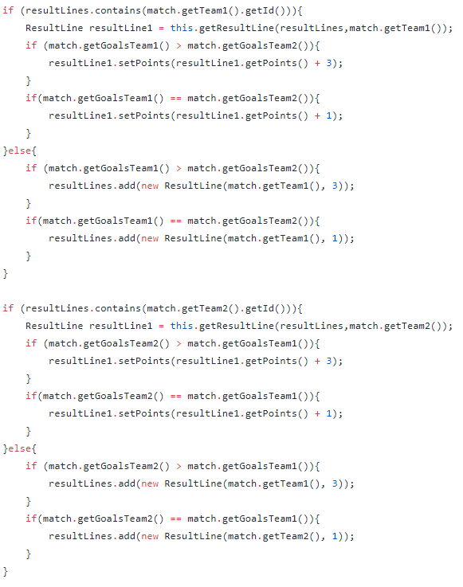
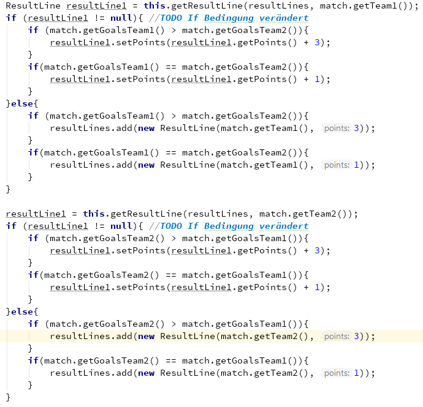

# Erweiterung & Verbesserung von Stefan Leithenmayr (Katalognummer 12)

## Erweiterung

    
Erweiterung, sodass keine Matches doppelt eingefügt werden

    
     
    
     

## Verschieben der Initialisierung in den Konstruktor

    
Alter Code:

    
     
    
Neuer Code:

    
     

## Verwenden der Equal Methode

    
Da ich die Equal Methode der Entität Team bereits überschrieben habe sollte man diese auch verwenden

    
     

## Falsche Sortierung

    
Sortierung absteigend statt aufsteigend!

    
     

## Forschleife verändern

    
     

## Verwendung einer Variable und kein mehrfach Aufruf

    
Wird verändert da die Methode getResultLine bzw. .Contains ansonsten mehrfach aufgerufen wird und jetzt ruft man die Methode nur zweimal auf und .Contains wird nicht mehr benötigt

     
    
Alter Code:

    
     
    
Neuer Code:

    
     

